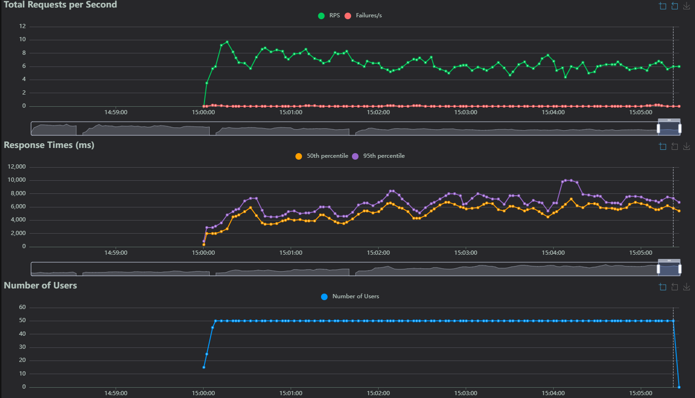
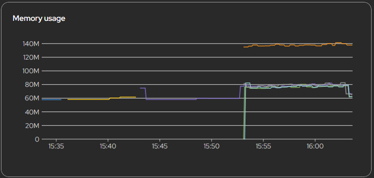
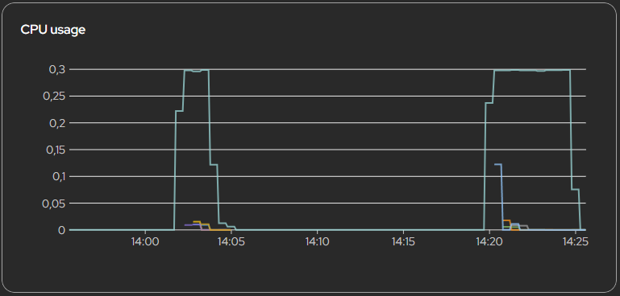
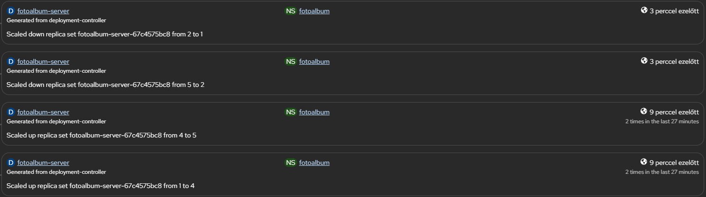
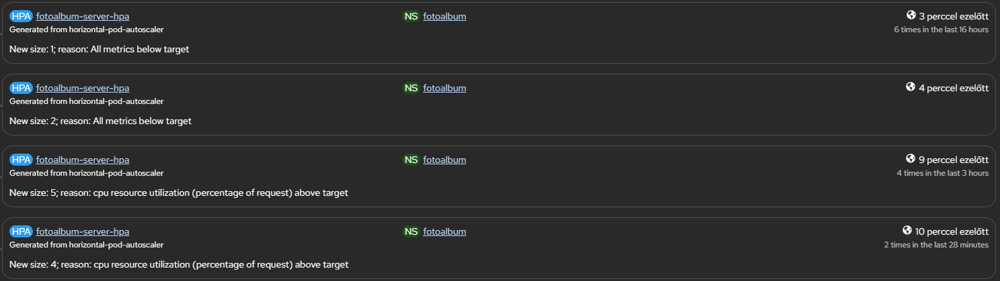

# Terheléspróba jegyzőkönyv

A skálázhatóság tesztelésére egy felhőből futtatott megoldást válaszottam. A terheléspróbát a `Locust`, Python alapú terheléstesztelő alkalmazás végzi, melyhez először létrehoztam a projekt gyökerében egy `locust/` mappát, amibe a következő fájlokat írtam:

### A terheléspróba forgatókönyve: `locustfile.py`
A `locustfile.py` tartalmazza azokat a HTTP hívásokat, amiket a terhelés során a locust tesztel:

| Metódus | Súly | Leírás |
| ------- | ---- | ------ |
| `list_images` | 5 | Képek lekérdezése |
| `upload_image` | 3 | Egy 1x1px PNG kép feltöltése |
| `delete_image` | 2 | Egy véletlenszerű kép törlése |
| `get_me` | 1 | A bejelentkezett felhasználó adatainak lekérése |
| `on_start` | - | Minden virtuális felhasználó induláskor bejelentkezik és eltárolja a kapott JWT token-t |

### A Locust Dockerfile-ja
A `Dockerfile.locust` fájl tartalmazza a Locust alkalmazás konténerizációs lépéseit.

## A Locust alkalmazás konfigurációja OpenShift-en
Ahhoz, hogy a felhőből futtathassam a Locust terheléspróbáját, egy új szolgáltatást kellett futtatnom.
Ehhez létrehoztam a következőket:
* Új **ImageStream**: `fotoalbum-locust`
* Új **BuildConfig**: `fotoalbum-locust`
* Új **Deployment**: `fotoalbum-locust`
* Új **Service**: `fotoalbum-locust`
* Új **Route**: `fotoalbum-locust`

Ezen felül a Github Actions workflow fájlba felvettem a locust-ot is, mint service-t, hogy a CI/CD pipeline részeként a locust alkalmazás is frissüljön:
```yaml
strategy:
      fail-fast: false
      matrix:
        service: [auth, server, frontend, locust]
```

## A terheléspróba
A terheléspróbát az előző fejezetben említett *Route* megnyitásával kezdtem, ami a Locust alkalmazás felületére vezetett.

A vizsgálat előtt megnyitottam az OpenShift felületén a következőket:
* fotoalbum-server (Deployment): ***Events*** fül
* fotoalbum-server (Deployment): ***Metrics*** fül
* fotoalbum-server-hpa (HPA): ***Events*** fül

(emellett a futás alatt a Locust felületén a ***Charts*** fülön tekintettem a további jellemzőket)

Egyéb információk:
* <u>A terheléspróba időpontja</u>: 2026.03.26. 15:52 - 16:02 (10 perc)
* <u>Virtuális felhasználók száma</u>: 50
* <u>Ramp-up ráta</u>: 5 felhasználó / mp

## Eredmények, események
Az alábbi kép a Locust felületén mutatja be a HTTP kérdés- és válasz értékeket a tesztelés idején. Látható mindhárom grafikonon a folyamatos terhelésnövekedés (a ramp-up miatt fokozatosan, nem hirtelen), valamint, hogy idővel stabilizálódtak a kiszolgálások a felskálázódás miatt.



Az OpenShift felületén látható, hogy a tesztelés megkezdése után megugrottak a memória- és processzor kihasználtságok, aminek következtében új Pod-ok indultak. A lila görbe az első Pod terhelését mutatja. Látszik, hogy ez kapta a legnagyobb terhelést a többi közül. Ennek oka, hogy a hirtelen történt terhelésnövekedés ugyan új Pod-okat indított, de ezek elkészüléséig csakis az első Pod kapta a terhelést. Amint készen álltak az új podok, a terhelés nagyjából egyenletesen lett elosztva.



Végül pedig lássuk milyen események zajlottak le a szerver Deployment-jében, valamint a HPA-nál:



Az ábrákon jól látható:
* A terhelés kezdetekor +2 Pod indult (1 → 3)
* Majd rögtön még 2 (3 → 5)
* A teszt után (16:04-kor, 2 perccel a teszt vége után) leskálázódott először 2, majd végül 1 Pod-ra

### Tanulságok
A tanulságokról az `INSIGHTS.md` dokumentumban lehet olvasni.

<!-- Az egyetemi OpenShift környezetben létrehoztam egy -->
<!-- TODO: eszköz konfigurációja (Locust)
Locust felhőbe futtatásának konfigja -->

